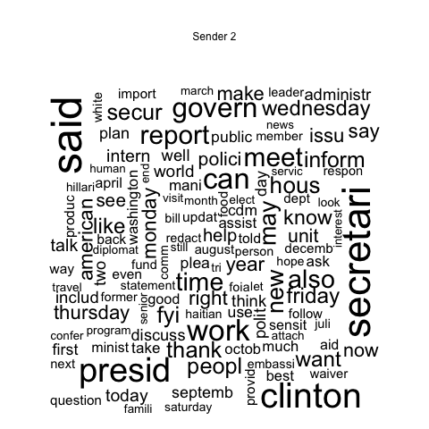
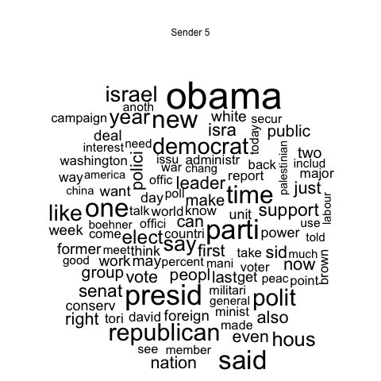
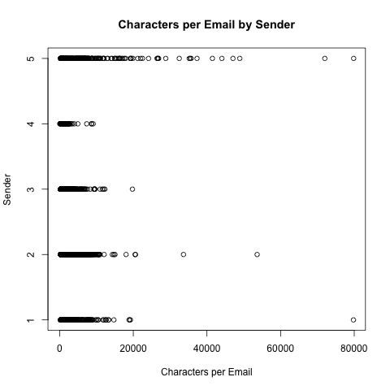

```{r, include=FALSE}
library(pander)
```

## Data Processing

The initial training data consisted of a tab separated file with two columns: the sender code (labeled 1-5) and the string of the email. With 1200 emails in the training set and another 105 as our test set, we proceeded to converting the emails into a frequency matrix.

After reading in the tsv, we converted the string to a character vector. We then wrote those vectors to a corpus so that we could use the R package `tm` to remove punctuation, numbers, and stop words; convert to lower case; and stem. 

Next, we removed common words that were seen in every email, such as "subject", and "US", and words that were seen in 3 or fewer emails- this helps us eliminate the long tail of words that are used too infrequently to provide any sort of pattern. 

We visualized some of the data to get a sense of its distribution and possibly pick out other useful characeristics. We first looked at the sender frequency.

```{r, out.width = "300px", echo=FALSE}

```

*Figure 1: Sender 3 has by far the most emails, while 4 and 5 both have about a third the amount of both 1 and 2*

We also did some wordclouds to visualize the differences in word frequecy.

```{r, out.width = "250px", echo=FALSE}
 

knitr::include_graphics("../images/wordcloud3.png")


```

*Figure 2: Filtering the wordclouds to use only words appearing more than 200 times yielded some interesting results - the senders with the highest quantity of high-frequency words (the largest wordclouds) are not the senders with the most emails.*

We were curious about other qualities besides word frequency and took a quick look at the number of characters in each email.

```{r, out.width = "300px", echo=FALSE}

```

*Figure 3: The distributions seem different enough that this could be a useful feature.*

We also explored other possible features that could predict sender, including number of words, average word length, and rate of use for ampersands, semicolons, question marks, and upper case, numerals, and hyphens. We performed simple one-way ANOVA to determine whether or not to include the extra feature in our matrix. 

We found that words per email, number of hyphens divided by number of words, and number of numerals divided by number of words all yielded small p-values. Ordinarilly we would be concerned with the significance issues that arise with multiple testing, but this was just a prelimary vetting. We added these three as features to our matrix. It is worth noting that this method is not ideal, as any significant higher-level interactions will be missed.

Through these steps, we produced feature matrices with the following numbers of terms:

```{r, echo=FALSE}
Terms <- c(38066, 37966, 27504, 9177, 9180)
Steps <- c("Raw", "Stop Words", "Stemmed", "Frequency Selection", "Additional Features")
pander(data.frame(Steps, Terms))
```

Unfortunately, our reduced feature matrix was still extremely large, at 9180 columns. We tried two strategies to reduce the number of columns. 

The first was to use univariate ANOVA to remove features that had no statistical significance. As mentioned before, this method is not highly defensible statistically; it both creates problems with multiple testing (since we are running about 9000 hypothesis tests), and will miss any features that have significant interaction effects but not one-way effects. However, we thought it might be worth a try, so we selected only words whose ANOVA produces p-values of less than 0.05, resulting in 3599 features. Unfortunately, this data produced higher error rates than the original, probably due to lost information that could not be captured in a one-way analysis.

The second was a feature selection method called the Boruta algorithm. The Boruta algorithm avoids the problem of only catching one-way signficance. This algorithm takes a sample of the data and shuffles within-column values. Then it compares the results of running RF on the "shadow" data with the original data. If a real feature has higher importance than the best of the shadow features, it is confirmed as important.

Sadly, when we ran Boruta, nearly all of the features were rejected as unimportant. We took the small subset (11 features) that was labeled "tentative", and computed a power feature matrix that went up to cubic powers, including interactions (about 1200 features). However, we did not have high expectations for this data set, as it gave up an enormous amount of information.


### References

Tutorial for using tm and wordcloud:
https://eight2late.wordpress.com/2015/05/27/a-gentle-introduction-to-text-mining-using-r/

Tutorial for using Boruta:
https://www.kaggle.com/jimthompson/bnp-paribas-cardif-claims-management/using-the-boruta-package-to-determine-fe/comments
